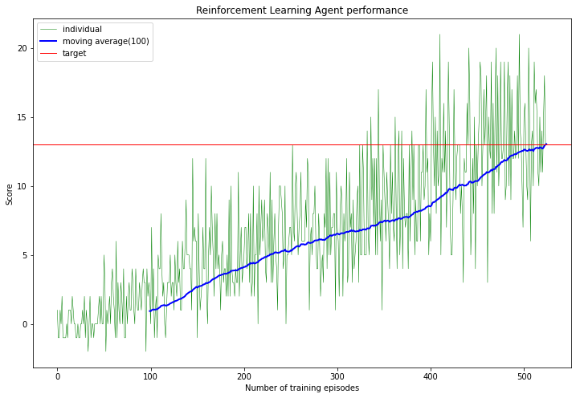
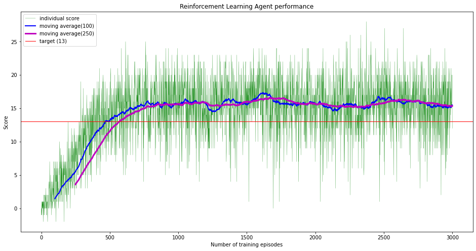

# Report on Reinforcement Learning Algorithm
## By Doug Wight - 26/01/2021

### Description
This is project 1 of Udacity Reinforcement Learning NanoDegree.  
It utilises a Unity environment, to collect yellow bananas whilst avoiding blue bananas 
For more information of the environment set up etc, please refer to the README.MD file

### Algorithm used
I used a Deep-Q network algorithm. 
This is a deep neural network used to process the 37-dimensional input signal
through a number of fully connected layers, using RELU layers to introduce non-linearity. 
I used PyTorch to construct the network

### Algorithm improvements
In addition to the deep network, I also used implemented the following:
* Experience replay: to ensure that the model learns from a broad range of
states, rather than potentially falling into self-reinforcing loops.
* Fixed-Q targets: to avoid potential circularity in the network, using a clone
of the network to calculate the next state values, and updating this on a less
frequent basis.

### Specifics of the network
* Code for the network can be found in network.py
* This code is a three layer network.
* It does allow for tailoring of the size of each layer.
* In the notebook that I created, I used the following sizes:
	- layer 1: 128 nodes
	- layer 2: 64 nodes
	- layer 3: 16 nodes
	- final layer (output layer): 4
* The final layer of 4 corresponds the the action size for the environment

### Hyperparameters used
1. Dropout in neural network. Not used
1. Learning rate: 0.0005. Speed of adjustment of weights
1. Buffer size: 100,000. Number of experience tuples to hold in memory to sample from
1. Batch size: 64. The number of experiences to sample each time from the memory, to learn from
1. Gamma: 0.99. The discount rate. Values nearer experiences and rewards more than farther ones
1. Tau: 0.001. The rate of adjustment of the target network to the local network (for target-q)
1. Update_every: 4. Number of steps to wait before the target network is adjusted

### Hardware used
I trained the model on a CPU (Macbook with 2.7 GHz i5 and 8GB memory). It took a while, but not too long.

### Results
It took 425 episodes to achieve the required score of 13. (the environment rewarded
you getting yellow bananas with +1 point, and penalised you for collecting blue
bananas with -1 point. You have a total of 300 time steps to gather these bananas)

### Further work done
1. I tested the agent under evaluation mode (rather than training mode). It achieved
a score of 16 (on a very scientific sample of one run!)

1. Attempted to train the same network/agent configuration over 3000 episodes, after
calculating that the training should take c. 1 hour to do this.  
This achieved an average score of c. 15.5. From looking at the chart below it looks
like this was achieved at around episode 800, and there was really no further
benefit from training more
 
 
3. I tested this second agent (trained over 3000 episodes), in evaluation mode. 
This time I did a series of 10 runs. The average was 15.7 (high of 22, low of 10)
 
### Suggestions for further work
1. Design an agent to learn from the pixels of the state, rather than the 37 dimension vector
1. Tweak the parameters of the neural network to see if better scores can be achieved. E.g.
	* regularization (dropout)
	* more layers, or more nodes per layer
	* batch normalization
1. Use different RI techniques - e.g.
	* Prioritized experience replay
	* Duelling DQNs